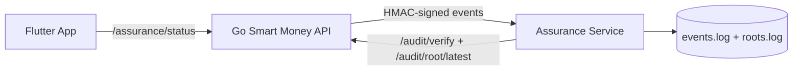
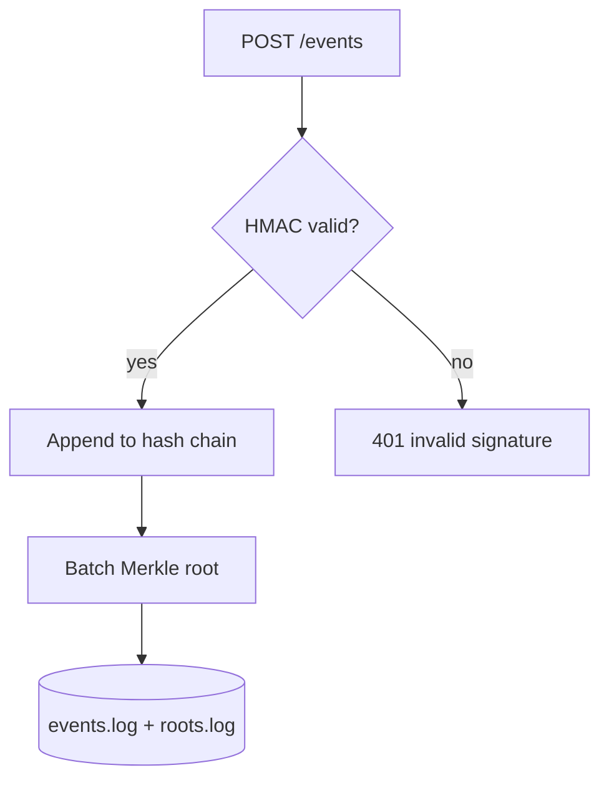

# Assurance Service

Audit-grade assurance for security-critical systems. This service accepts
HMAC-signed events, writes them to a tamper-evident hash chain, and exposes
verifiable proof (Merkle roots + offline verification). It also provides a
policy-as-code decision API and privacy-preserving aggregates.

This is built for systems where "security" is not enough and you need
verifiable evidence that the system behaved correctly.

## Why this matters

Most systems can say "trust me." This service can **prove** it. The audit log is
append-only and self-verifying. If anyone tries to change history, verification
fails. That is the core assurance guarantee.

## Architecture diagram (system context)



## Architecture diagram (inside the assurance service)



## What you can prove

- **Tamper evidence**: any edit, deletion, or reorder is detectable.
- **Provenance**: only a trusted emitter can submit events (HMAC).
- **Auditability**: verification can be repeated offline with the CLI.
- **Assurance-first design**: evidence artifacts are first-class outputs.

## Demo in 3 minutes (what to show)

1) Start the assurance service.
2) Send a signed event.
3) Show `/audit/verify` returning OK.
4) Corrupt the log and show verification fails.

Commands are below.

## Quick start

```bash
cd assurance-service
ASSURE_SHARED_SECRET=dev_secret go run ./cmd/assure-server
```

Health check:

```bash
curl -s http://127.0.0.1:9010/health
```

## Send a signed event (HMAC)

```bash
body='{"type":"policy.decision","source":"demo","timestamp":"2025-01-01T00:00:00Z","payload":{"user":"u1","action":"swap.execute","allow":true}}'
sig=$(printf '%s' "$body" | openssl dgst -sha256 -hmac "dev_secret" | sed 's/^.* //')

curl -s -X POST http://127.0.0.1:9010/events \
  -H "Content-Type: application/json" \
  -H "X-Assurance-Signature: sha256=$sig" \
  -d "$body"
```

## Verify the audit log

```bash
curl -s http://127.0.0.1:9010/audit/verify
curl -s http://127.0.0.1:9010/audit/root/latest
curl -s "http://127.0.0.1:9010/audit/events?limit=5"
```

## Tamper-evidence demo (fail on modification)

```bash
cd assurance-service
cp -R data data_demo
printf "x" >> data_demo/events.log

go run ./cmd/assurectl verify --data ./data_demo --batch 100
```

If the log is modified, verification returns errors.

## API endpoints

- `GET /health`
- `POST /events` (HMAC signed)
- `GET /audit/root/latest`
- `GET /audit/verify`
- `GET /audit/events?limit=100`
- `POST /policy/check`
- `GET /privacy/tokens?window_hours=24&k=5&epsilon=0.7&seed=0`

## Event format

Minimal example:

```json
{
  "id": "optional",
  "type": "policy.decision",
  "source": "api",
  "timestamp": "2025-01-01T00:00:00Z",
  "payload": {
    "user": "u1",
    "action": "swap.execute",
    "allow": true
  }
}
```

If `id` is not provided, the service computes a stable hash of the event.

## HMAC signing details

The service expects:

```
X-Assurance-Signature: sha256=<hex>
```

Where `<hex>` is HMAC-SHA256 of the raw request body using
`ASSURE_SHARED_SECRET`.

## Policy engine

Rules are defined in `policies/policy.json`. Example input:

```bash
curl -s -X POST http://127.0.0.1:9010/policy/check \
  -H "Content-Type: application/json" \
  -d '{"subject":{"id":"u1","roles":["user"],"attributes":{"tier":"free"}},"action":"wallet.send","resource":"wallet","context":{"amount_sol":0.5}}'
```

The engine evaluates rules and returns allow/deny with reasons.

## Privacy aggregates

`GET /privacy/tokens` computes k-anon + differential privacy summaries
from the event log. If the count is below k, results are suppressed.

## CLI verification (offline)

```bash
go run ./cmd/assurectl verify --data ./data --batch 100
```

## Data storage (evidence artifacts)

By default the service writes:

- `data/events.log` (append-only record chain)
- `data/roots.log` (Merkle roots per batch)

These files are the evidence artifacts for audits. They are intentionally
append-only and can be verified offline.

## Environment variables

- `ASSURE_PORT` (default 9010)
- `ASSURE_DATA_DIR` (default ./data)
- `ASSURE_SHARED_SECRET` (required for signatures)
- `ASSURE_BATCH_SIZE` (default 100)
- `ASSURE_K_ANON` (default 5)
- `ASSURE_DP_EPS` (default 0.7)
- `ASSURE_DP_SEED` (default 0)

## Integration with the Go backend

Set these in your backend `.env`:

```
ASSURANCE_URL=http://127.0.0.1:9010
ASSURANCE_SHARED_SECRET=dev_secret
```

The backend signs events and posts to `/events`. It exposes `/assurance/status`
so the UI can show a Verified/Unverified badge.

## Formal verification artifact

The audit-chain invariant is specified in:

- `specs/audit_chain.tla`

This is a lightweight formal spec that captures the expected hash-chain
properties and batch-root behavior.

## Troubleshooting

- `503 assurance unavailable` from the backend means `ASSURANCE_URL` is empty or
  the assurance service is not running.
- `401 invalid signature` from assurance means `ASSURE_SHARED_SECRET` does not
  match the backend's `ASSURANCE_SHARED_SECRET`.
- If verification fails, inspect `events.log` and `roots.log` for corruption.

## License

MIT
